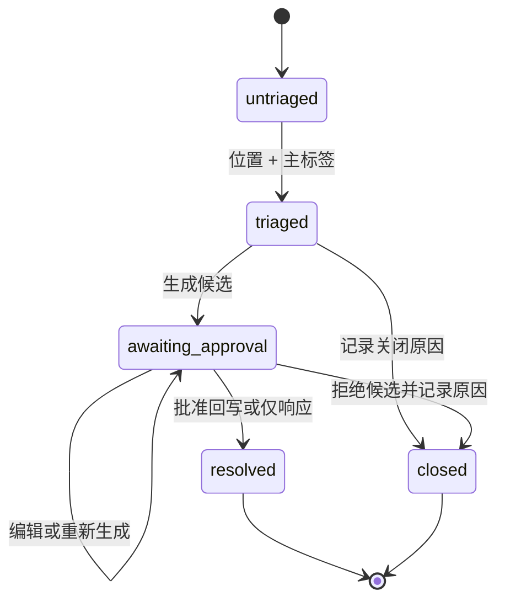
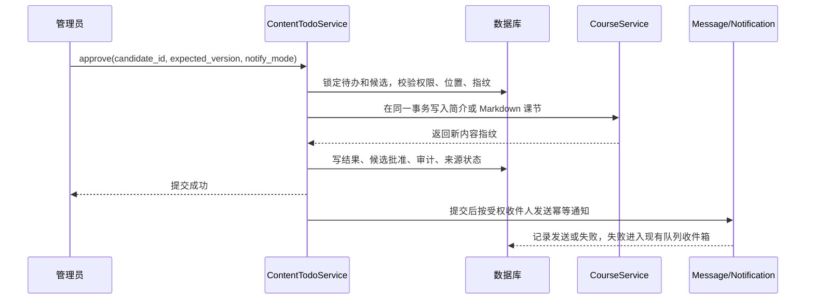
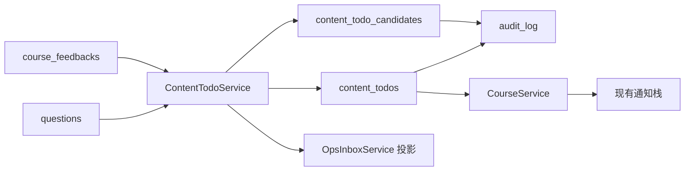

# 课程内容待办反馈闭环 - Plan

## Goal Capsule

- **Objective:** 管理员能够把课节问答和私有课程反馈推进到“内容已改善、只完成响应或明确不改”的可追溯结果，并让允许的学员收到不越权的结果通知。
- **Means:** 扩展现有运营收件箱作为统一入口，用独立内容待办记录保存分诊、位置、候选和结果；候选经过人工批准后复用现有课程写入服务。
- **Product authority:** Product Contract 及其 R/A/F/AE/SC ID 负责产品行为；现有问答公开性、私有反馈、数据范围、课程发布、通知和消毒规则继续负责各自领域的不变量。
- **Stop conditions:** 不自动发布候选；不把私有反馈正文写入学员通知、公开问答或评价；不允许范围外管理员读取、批准或写回；不以 `ops_inbox_state.resolved` 代替内容结果。
- **Execution profile:** 深度跨层实现，包含可回滚迁移、服务层权限收口、契约、管理端流程和 Compose 验证。
- **Tail ownership:** 实现完成后由执行者完成测试、镜像重建、文档审查遗留项和 Git 交付；本计划不包含 commit、push 或 PR 决策。

---

## Product Contract

### Summary

管理端将把课节问题和私有课程反馈纳入同一个内容待办流程。每条待办保留来源可见性和课程位置，支持四类主标签、管理员响应、可编辑候选草稿、人工批准、内容回写、学员通知和审计。

### Problem Frame

学员已经可以提课节问题和提交私有课程反馈，管理员也可以把来源记录标记为已处理。但来源状态结束不代表内容已经改善，也不代表提交者已经收到可见响应。

当前缺少一个能够记录目标位置、内容类别、首次响应、候选决定和最终结果的闭环。没有这个闭环，重复困惑会继续回到问答或反馈列表，且运营无法证明一次内容改动是否经过授权和人工确认。

### Key Decisions

- **D1. 扩展现有运营收件箱模式。**（session-settled: user-approved - 选择它而不是独立的内容质量队列，因为可以避免重复建设列表、年龄、深链、状态和审计行为。）Governs R1, R5, R19, R21。
- **D2. 只保留四选一的主内容标签。**（session-settled: user-approved - 选择它而不是细粒度分类体系，因为首版需要的是分流信号，而不是知识分类系统。）Governs R6。
- **D3. 把生成的补充说明视为草稿。**（session-settled: user-approved - 选择它而不是自动发布，因为学员可见内容必须经过管理员确认。）Governs R10, R11, R12。
- **D4. 保留来源可见性。** 公开课节问答继续对有权学员可见，私有课程反馈继续只对有数据范围的管理员可见，学员通知只触达允许的提交者或相关学员。Governs R2, R16, R18, R22。

### Actors

- A1. **学员：** 提交课节问题、提交私有课程反馈，或接收学员可见的处理结果通知。
- A2. **管理员：** 查看内容待办、确认位置、选择标签、响应、编辑或批准候选、拒绝候选、关闭待办和选择通知对象。
- A3. **系统：** 从现有来源派生待办，保存内容工作流，生成草稿，验证目标内容版本，执行授权写回，写入审计，并通过现有通知栈发送幂等通知。

### Requirements

**内容待办接入与分诊**

- R1. 管理端必须在一个内容待办流程中展示课节问题和私有课程反馈，同时保留每条来源类型。
- R2. 管理员读取或操作待办前，待办必须显示来源是公开问答还是私有反馈。
- R3. 来源已有位置时，待办必须定位到课程、章节和课节。
- R4. 没有课节位置的课程级反馈必须保持有效，管理员必须能在内容回写前确认或修改目标位置。
- R5. 列表和详情必须显示每条待办的积压年龄与首次响应状态。
- R6. 每条待办在进入内容处理前必须选择一个主标签：`错误`、`缺例子`、`资源问题`或 `其他`。
- R7. 只有管理员记录了重复、不可行动、已有覆盖或暂不计划等可见原因后，待办才可以在没有内容回写的情况下关闭。

**响应与内容结果**

- R8. 对公开问答，首次响应是第一条对原提问学员可见的管理员回答。
- R9. 对私有反馈，首次响应是第一条对学员可见的确认或结果通知，不是内部状态变化。
- R10. 系统可以生成补充说明候选，但候选必须是绑定待办、标签、位置和选定来源上下文的草稿。
- R11. 候选影响任何学员可见目标前，管理员必须能批准、编辑、拒绝或重新生成候选。
- R12. 获批候选可以通过现有内容维护流程回写课程或课节内容，且写入前必须有一次管理员确认。
- R13. 帮助中心输出纳入获批候选交接；除非产品已有受支持的帮助中心编辑界面，否则不纳入直接发布。
- R14. 内容待办的最终结果必须记录它是更新了课程内容、产生了帮助中心候选、只发送了响应，还是在没有内容变化的情况下关闭。

**学员通知与可见性**

- R15. 学员可见结果产生后，系统只能通知来源规则和管理员选择确定的受影响学员。
- R16. 通知不得包含私有反馈正文、管理员备注、被拒绝的草稿或收件人本来无权访问的来源材料。
- R17. 公开问答更新可以链接到有权学员可访问的课程或问题上下文。
- R18. 私有反馈通知可以告诉提交者反馈已处理或促成了更新，但不得把反馈发布到评价、问答或课程讨论中。

**治理与安全**

- R19. 所有标签变更、位置变更、候选决定、内容回写、关闭原因和学员通知都必须可审计。
- R20. 生成或管理员编辑的富文本在渲染或作为公开内容存储前，必须经过同一套学员可见内容消毒边界。
- R21. 内容待办的数据范围必须遵循当前课程数据范围规则，直接访问范围外待办必须被拒绝。
- R22. 公开评价继续处于本流程之外；隐藏、恢复、回复或计分评价不得创建或修改内容待办。

### Key Flows

- F1. **内容待办出现**
  - **Trigger:** 学员提交待回答的课节问题或待处理的私有课程反馈。
  - **Actors:** A1、A2、A3
  - **Steps:** 系统从来源表派生行；首次打开或操作时创建唯一内容待办记录；列表保留来源、位置、年龄和首次响应状态。
  - **Outcome:** 管理员可以在不丢失来源位置和隐私边界的情况下分诊问题。
  - **Covered by:** R1、R2、R3、R4、R5、R21
- F2. **管理员分诊并响应**
  - **Trigger:** 管理员打开内容待办。
  - **Actors:** A2、A3
  - **Steps:** 管理员确认位置、选择一个主标签、按来源响应，并选择生成候选或记录关闭原因。
  - **Outcome:** 待办拥有可追溯的内容质量分类、首次响应和后续处理路径。
  - **Covered by:** R6、R7、R8、R9、R14、R19
- F3. **候选变成内容**
  - **Trigger:** 管理员请求生成或重新生成补充说明候选。
  - **Actors:** A2、A3
  - **Steps:** 系统保存当前目标内容指纹和草稿版本；管理员编辑、拒绝或批准；批准时重新校验指纹并通过课程写入服务更新目标。
  - **Outcome:** 学员可见内容只会通过已批准且未过期的候选变化。
  - **Covered by:** R10、R11、R12、R20
- F4. **结果触达学员**
  - **Trigger:** 内容待办产生了学员可见结果。
  - **Actors:** A1、A2、A3
  - **Steps:** 系统解析提交者或当前有权学员；通知正文只包含安全的结果摘要；消息使用稳定幂等键并保留资源链接。
  - **Outcome:** 学员看到处理结果，同时不跨越公开与私有边界。
  - **Covered by:** R15、R16、R17、R18

### Acceptance Examples

- AE1. **Covers R1、R3、R5、R6、R8、R10、R12、R15。** Given 学员询问某个课节概念为什么没有例子，When 管理员回答并将待办标为 `缺例子`，Then 待办显示课节位置、首次响应时间和积压年龄，并能生成一个在更新课节前必须经过管理员确认的例子草稿。
- AE2. **Covers R2、R4、R9、R13、R16、R18。** Given 学员私下反馈某个 PDF 资源难以理解，When 管理员确认受影响课节并完成处理，Then 反馈正文仍保持私有，发给学员的通知不包含原始私有正文。
- AE3. **Covers R7、R14、R19。** Given 管理员以“已有覆盖”为由关闭待办，When 待办被解决，Then 最终结果记录没有内容变化，关闭原因可审计。
- AE4. **Covers R10、R11、R20。** Given 生成的候选包含不安全 HTML 或不安全链接，When 管理员预览或批准它，Then 在学员可见内容存储或渲染前，不安全内容会被移除或阻断。
- AE5. **Covers R21、R22。** Given 管理员不具有某课程的数据范围且该课程存在公开评价，When 管理员打开内容待办，Then 看不到范围外待办，评价流程保持不变。

### Success Criteria

- SC1. 至少 80% 的开放内容问答和反馈待办在关闭前拥有已确认的课程级或课节级位置。
- SC2. 生成候选在没有管理员批准事件的情况下变为学员可见的比例为 0。
- SC3. 私有反馈正文出现在公开评价、公开问答、课程讨论或发给其他学员的通知中的比例为 0。
- SC4. 管理员无需先打开原课程编辑器，就能从待办列表或详情识别来源类型、标签、首次响应、积压年龄和目标位置。
- SC5. 上线 30 天内，至少一半已解决的 `错误`、`缺例子` 和 `资源问题` 待办以获批内容更新、获批帮助中心候选或明确无变更原因为结局。

### Scope Boundaries

- 公开评价不是本流程的接入来源，现有评价隐藏、恢复、回复和计分逻辑不变。
- 不允许自动发布；生成候选在管理员批准前都只是草稿。
- 首版不做自动相似度聚类、机器学习推荐、外部 LLM provider、私有反馈的学员可见讨论串或更细粒度分类。
- 帮助中心只保存获批候选和交接信息；当前没有受支持的帮助中心编辑界面，因此不做直接发布。
- 首版只直接回写课程简介和 Markdown 课节正文；PDF 或视频资源问题只能记录、通知、交接或关闭，不能伪造文字补丁。
- 本流程不会自行重置学习进度；内容变化遵循现有课程和进度规则。

### Dependencies and Assumptions

- 现有课节问答继续对有权学员公开，并继续使用 `questions.answered_at` 作为首次管理员回答的权威时间。
- 私有反馈继续只按课程数据范围对管理员可见，并与 `reviews` 完全分离。
- `MessageService` 和 `NotificationDispatchService` 继续是唯一的学员站内通知入口；通知失败由现有队列失败和重试机制处理。
- 没有现成内容生成 provider；首版生成器是服务端的来源上下文草稿构造器，输出必须可编辑，后续 provider 接入不改变候选和批准契约。
- 旧的待处理来源不做全量内容回填。列表对未初始化来源显示派生默认值，首次操作时按完整 `source_type + source_key` 创建记录。

### Sources and Research

- `specs/001-personal-learning-site/spec.md`：课节问答、课程编辑、学员通知和数据范围规则。
- `specs/010-course-notify-feedback-codes/spec.md`、`specs/010-course-notify-feedback-codes/research.md`：私有反馈、消毒和与评价隔离。
- `specs/014-ops-exception-inbox/{spec.md,data-model.md,contracts/api-contract.md,quickstart.md}`：收件箱派生模型、状态流转、权限、年龄和深链。
- `docs/adr/0005-data-scope-follows-course-department.md`、`docs/adr/0006-course-qa-is-public.md`：课程数据范围和问答公开性。
- `apps/api/app/service/OpsInboxService.php`、`apps/api/app/service/QuestionService.php`、`apps/api/app/service/CourseFeedbackService.php`：现有来源和权限边界。
- `apps/api/app/service/CourseService.php`、`apps/api/app/service/PublicLessonService.php`、`apps/api/app/support/HtmlSanitizer.php`：课程写入、Markdown 展示和消毒边界。
- `apps/api/app/service/MessageService.php`、`apps/api/app/service/NotificationDispatchService.php`、`apps/api/app/service/NotificationFanOutExecutor.php`：通知幂等、资源链接和失败重试。
- `docs/solutions/test-failures/setUp-must-mirror-constructor-invariant-guards.md`：新增服务构造约束或全局开关时，测试 `setUp()` 必须显式固定依赖状态。

**Product Contract preservation:** Product Contract unchanged; this pass adds implementation decisions and verification detail only.

---

## Planning Contract

### Key Technical Decisions

- KTD1. **独立保存内容工作流，不扩展 `ops_inbox_state`。**（session-settled: user-approved - 选择独立领域记录而不是把字段塞进通用状态表，因为收件箱状态只代表运营操作者状态。）Governs D1, R1, R5, R6, R7, R10, R11, R14, R19, R21。新增 `content_todos` 以 `(source_type, source_key)` 唯一标识来源，`content_todo_candidates` 以待办和递增版本保存候选历史；`ops_inbox_state` 继续只保存 `open/snoozed/assigned/retrying/resolved`。
- KTD2. **首版候选使用无 provider 的服务端草稿构造器。**（session-settled: user-approved - 选择可回滚的本地实现而不是引入外部模型依赖，因为当前代码库没有内容生成 provider。）Governs D3, R10, R11。构造器按来源类型、主标签、目标格式和当前内容生成可编辑草稿；不会把候选直接写入课程或通知。
- KTD3. **首次响应按来源保留权威字段。**（session-settled: user-approved - 选择来源权威字段和待办投影，而不是把所有来源重写成一种状态。）Governs D4, R8, R9, R18。问答读取 `questions.answered_at`；私有反馈在第一条成功写入的学员通知后写入待办 `first_response_at` 和响应类型；`processed` 不能单独证明反馈已经响应。
- KTD4. **所有内容写回经过带管理员身份和目标指纹的 `CourseService`。** 候选批准在同一事务中校验管理员数据范围、目标归属、`course.manage` 权限和生成时指纹；课程简介通过 `HtmlSanitizer`，Markdown 课节继续复用 `PublicLessonService` 的展示消毒边界；指纹变化时返回冲突，不覆盖其他管理员的新内容。
- KTD5. **批准、内容写入和审计原子提交，通知提交后发送。** 候选状态、目标内容、待办结果和对应 `audit_log` 在一个事务内完成；通知使用 `MessageService` 或现有通知 fan-out，带稳定幂等键；通知失败不回滚已批准内容，但记录失败并交给现有队列收件箱重试。
- KTD6. **动作权限和课程数据范围在 service 层双重收口。** 列表继续使用 `ops_inbox.view`，内容操作增加 `content_todo.manage`；问答响应仍需 `qa.answer`，私有反馈响应仍需 `course_feedback.manage`，内容写回仍需 `course.manage`。`feedback_pending` 不再因 `review.view` 单独可见，公开评价不会进入内容待办。
- KTD7. **保留现有入口，禁止旧入口绕过闭环。** 运营收件箱继续作为列表和深链入口；问答和反馈旧管理 API 改为调用内容待办编排服务或创建待办投影，不再用来源状态直接宣称内容闭环完成。内容详情返回审计时间线，避免把 `audit_log` 强行混入只服务评价的 `moderation_logs`。
- KTD8. **位置变更使旧候选失效。** `target_course_id/target_chapter_id/target_lesson_id` 变更时，当前候选标记为 `superseded`；批准只能使用与目标位置、内容格式和当前指纹一致的候选版本。

### High-Level Technical Design

#### 内容待办状态

`workflow_status` 是内容结果状态，不能由 `ops_inbox_state` 推断。候选自身有 `draft/superseded/approved/rejected` 状态；来源仍使用 `questions` 的问答状态或 `course_feedbacks` 的 `pending/processed` 状态。

#### 批准和通知顺序

#### 数据边界

### Data Model and Migration

- 新增 `content_todos`：
  - `source_type`、`source_key`：只允许 `question_pending`、`feedback_pending`，唯一键为二者组合。
  - `source_course_id`：保存来源课程，便于范围过滤和历史读取；不替代通过课程表重新解析部门范围。
  - `target_course_id`、`target_chapter_id`、`target_lesson_id`：目标位置，允许在首次分诊前为空；写回或关闭前必须满足位置规则。
  - `label`：`error`、`missing_example`、`resource_problem`、`other`，未分诊时为空。
  - `workflow_status`：`untriaged`、`triaged`、`awaiting_approval`、`resolved`、`closed`。
  - `first_response_at`、`first_response_kind`、`first_response_notification_id`：只在真实学员可见响应成功后填充。
  - `result_type`：`content_updated`、`help_center_candidate`、`responded_only`、`closed_no_change`。
  - `close_reason_code`、`close_reason_note`、`resolved_by_staff_id`、`resolved_at`、`version`、时间戳。
- 新增 `content_todo_candidates`：
  - `content_todo_id`、`version`、`target_course_id`、`target_chapter_id`、`target_lesson_id`。
  - `target_kind`：`course_intro`、`lesson_markdown`、`help_center_candidate`。
  - `body`、`body_format`、`base_content_fingerprint`、`generator`、候选状态、生成/批准/拒绝管理员和时间戳。
  - 唯一键为 `(content_todo_id, version)`；每次重新生成创建新版本，旧版本变为 `superseded`。
- 外键删除策略按来源生命周期选择：候选和待办不能阻止课程内容删除；历史记录在来源被级联删除时不允许成为可见学员数据。实现时用迁移的显式 `SET NULL` 或清理策略验证实际外键能力，不复制未验证的约束。
- 迁移必须可重复执行、可回滚，并为来源唯一键、状态/标签、候选版本和目标位置建立查询索引。不得回填已有来源正文或私有反馈全文。

### API and Permission Contract

- 复用 `/api/admin/v1/ops-inbox` 作为列表入口，新增内容字段和 `content_only` / `workflow_status` 过滤；详情及动作挂在 `/api/admin/v1/ops-inbox/content-todos`，避免创建平行运营队列。
- 规划的动作资源：
  - `GET /ops-inbox/content-todos`：分页列表。
  - `GET /ops-inbox/content-todos/{id}`：来源上下文、目标、首次响应、候选、结果和审计时间线。
  - `PATCH /ops-inbox/content-todos/{id}`：位置、主标签和并发版本。
  - `POST /ops-inbox/content-todos/{id}/respond`：按来源创建公开回答或私有确认通知。
  - `POST /ops-inbox/content-todos/{id}/candidates`：生成草稿；`PATCH .../candidates/{candidateId}` 编辑草稿。
  - `POST /ops-inbox/content-todos/{id}/candidates/{candidateId}/approve`：批准、回写和选择通知对象。
  - `POST /ops-inbox/content-todos/{id}/close`：以关闭原因结束且无内容回写。
- `packages/contracts/src/contentTodo.ts` 定义来源、标签、目标、候选、结果、收件人模式、审计和错误码；`packages/contracts/src/opsInbox.ts` 只增加可选内容投影字段。所有管理端响应继续通过现有 `ApiResponse` envelope 和 Zod 解析。
- `Authorize` 映射列表到 `ops_inbox.view`，内容动作到 `content_todo.manage`；服务层另外校验 `qa.answer`、`course_feedback.manage`、`course.manage` 和目标课程数据范围。`PermissionSeeder` 增加 `content_todo.manage`。
- `feedback_pending` 的源权限改为 `course_feedback.manage`；`review.view` 不能再单独看到私有反馈待办。

### Notification Contract

- 响应公开问答时继续通过 `MessageService::emit()` 写 `question_update`，资源链接指向问题或课程，并保留现有公开问答访问检查。
- 响应私有反馈时只给提交者发送通用确认或结果摘要；第一条成功写入的站内通知才填充 `first_response_at`。
- 内容更新通知支持 `none/submitter/enrolled/both`，默认只通知来源提交者；选择 `enrolled` 时由服务端按目标课程当前有效访问权解析收件人。
- 通知正文不得包含私有反馈正文、管理员备注、候选原文或拒绝草稿。通知只引用收件人可访问的课程资源。
- 单收件人通知使用稳定 `content_todo:<id>:<result_version>:<learner_id>` 幂等键；多收件人通知复用现有 fan-out 与重试，不新建推送栈。

### Assumptions

- 首版“生成”指服务端生成可编辑的结构化草稿，不承诺模型质量，也不需要外部 API key、队列或新供应商。
- 课程简介和 Markdown 课节是唯一直接回写目标；课程章节结构、PDF、视频、帮助中心都使用现有维护界面或候选交接。
- 现有发布状态和进度记录不因内容正文回写而自动重算；如果执行时发现某类写入会触发现有发布不变量，必须停在冲突并补充决策，而不是绕过校验。
- 历史已处理反馈若没有真实通知记录，首次响应显示为“未确认”，不能把 `processed_at` 伪装成学员已读响应。

### Sequencing

1. U1 先建立可回滚的数据边界和权限枚举。
2. U2 接通来源投影、位置、响应、关闭和数据范围。
3. U3 在 U2 的待办和位置契约上实现候选、指纹和批准回写。
4. U4 将通知、审计和已有课程写入/发布不变量接到事务边界。
5. U5 暴露管理 API、Zod contracts 和路由权限。
6. U6 实现收件箱抽屉、课程编辑深链和浏览器契约测试。
7. U7 运行完整 Compose 验证并修复只在真实迁移、权限或通知环境出现的问题。

---

## Implementation Units

### U1. 内容待办持久化和迁移

**Goal:** 建立不重复来源、可保存工作流状态和候选版本的数据库边界。

**Requirements:** R1、R4、R5、R6、R7、R10、R11、R14、R19、R21。

**Dependencies:** 无。

**Files:** `apps/api/database/migrations/20260910000001_content_todo_feedback_loop.php`; `apps/api/app/model/ContentTodo.php`; `apps/api/app/model/ContentTodoCandidate.php`; `apps/api/tests/ContentTodoSchemaIntegrationTest.php`; `apps/api/tests/MigrationSafetyTest.php`。

**Approach:**

1. 按 KTD1 创建独立的 `content_todos` 和 `content_todo_candidates`，使用 `(source_type, source_key)` 和 `(content_todo_id, version)` 唯一约束。
2. 将状态、标签、目标、首次响应、候选版本、结果和关闭原因作为领域字段，不把它们加入 `ops_inbox_state`。
3. 让迁移 down 路径在有业务数据时按项目既有回滚策略拒绝破坏性删除，保留数据安全边界。
4. 不回填现有来源正文；旧来源在首次操作时按完整来源复合键惰性初始化。

**Patterns to follow:** `apps/api/database/migrations/20260905000001_create_ops_inbox_state.php`; `apps/api/database/migrations/20260902000001_course_notify_feedback_codes.php`; `apps/api/app/model/OpsInboxState.php`; `specs/014-ops-exception-inbox/data-model.md`。

**Test scenarios:**

- 新迁移在空库和已有 `ops_inbox_state` 的库上创建两张表、索引和唯一约束。
- 相同 `source_type + source_key` 的重复待办插入被唯一约束拒绝或被 service 幂等复用。
- 同一待办的候选版本不能重复，重新生成创建更高版本并保留旧版本为 `superseded`。
- 迁移回滚前存在内容待办或候选数据时不会静默删除业务数据。
- 来源复合键包含不同来源类型时不会互相覆盖，即使两个来源的数字主键相同。

**Verification:** 迁移可在测试 Compose 数据库执行并回滚；schema integration test 能证明唯一键、索引和枚举状态与 contracts 一致。

### U2. 来源投影、分诊、响应和关闭编排

**Goal:** 把问答和私有反馈接入同一内容工作流，同时保留各自可见性和首次响应权威字段。

**Requirements:** R1-R9、R14、R18、R19、R21、R22。

**Dependencies:** U1。

**Files:** `apps/api/app/service/ContentTodoService.php`; `apps/api/app/service/OpsInboxService.php`; `apps/api/app/service/QuestionService.php`; `apps/api/app/service/CourseFeedbackService.php`; `apps/api/app/service/DataScopeService.php`; `apps/api/app/middleware/Authorize.php`; `apps/api/database/seeds/PermissionSeeder.php`; `apps/api/tests/ContentTodoServiceTest.php`; `apps/api/tests/QuestionServiceIntegrationTest.php`; `apps/api/tests/CourseFeedbackTest.php`; `apps/api/tests/CourseScopeIntegrationTest.php`; `apps/api/tests/AuthorizeLeakTest.php`。

**Approach:**

1. 按 KTD1、KTD3 和 KTD6 在 `ContentTodoService` 中按来源复合键惰性创建待办，问答默认复制课程/章节/课节位置，反馈默认复制课程位置并允许章节/课节为空。
2. 列表把现有派生来源和未完成的持久化待办合并；已回答或已处理但尚未产生最终内容结果的来源仍保留在内容待办列表。
3. 位置变更验证目标课程、章节和课节的父子归属，并同时校验来源课程和目标课程的数据范围。
4. 主标签、关闭原因、响应正文和状态变更都在 service 层校验、清洗并写审计；越权失败不得写待办、来源或审计。
5. 问答继续使用第一条管理员消息的 `answered_at`；反馈只有在 `MessageService` 成功写入学员通知后才写待办首次响应字段。
6. 旧问答回答/关闭和反馈状态更新入口改为调用编排服务或创建待办投影，不允许来源状态单独把内容待办标为最终完成。
7. `OpsInboxService` 对 `question_pending`、`feedback_pending` 禁止直接 `resolved`，改为深链到内容待办；反馈源权限只接受 `course_feedback.manage`。

**Execution note:** 先为跨来源列表、范围外拒绝和首次响应写集成测试，再调整旧 service 的状态路径，避免把 `processed` 或 `answered` 误当成内容闭环。

**Patterns to follow:** `apps/api/app/service/OpsInboxService.php`; `apps/api/app/service/QuestionService.php`; `apps/api/app/service/CourseFeedbackService.php`; `apps/api/app/service/DataScopeService.php`; `apps/api/tests/QuestionServiceIntegrationTest.php`。

**Test scenarios:**

- 同一列表同时返回问答和私有反馈，且每行带来源类型、位置、年龄、标签和首次响应状态。
- 课程级反馈在没有课节目标时仍可打开；未确认目标时不能生成候选、批准或关闭。
- 选择不属于目标课程的章节/课节、范围外课程或无权目标时返回拒绝且不写任何字段。
- 同一标签重复提交是幂等更新，不重复写审计；位置变化会使当前候选失效。
- 问答第一次管理员回答填充首次响应，第二次回答不移动首次响应时间。
- 私有反馈先标记 `processed` 但没有通知时，首次响应仍为未确认；第一条通知成功后才填充。
- `review.view` 但没有 `course_feedback.manage` 的管理员看不到私有反馈待办。
- 范围外管理员篡改待办 ID、来源 ID 或目标课程 ID 时读取、响应、关闭和审计都不发生。
- 没有关闭原因、空关闭说明或无效原因代码时，关闭请求被拒绝。
- 关闭原因是 `duplicate`、`not_actionable`、`already_covered` 或 `not_planned` 时，结果为 `closed_no_change` 且来源状态按来源规则更新。
- 公开评价创建、更新、隐藏或恢复不会创建内容待办。

**Verification:** service integration tests 能证明来源合并、状态边界、范围拒绝、隐私隔离和审计写入；旧问答/反馈测试继续通过。

### U3. 候选草稿、版本冲突和批准回写

**Goal:** 生成可编辑草稿，确保只有未过期且人工批准的候选能更新学员可见内容。

**Requirements:** R10-R14、R19、R20、SC2、SC5。

**Dependencies:** U1、U2。

**Files:** `apps/api/app/service/ContentTodoService.php`; `apps/api/app/service/CourseService.php`; `apps/api/app/controller/admin/CourseController.php`; `apps/api/app/support/HtmlSanitizer.php`; `apps/api/app/service/PublicLessonService.php`; `apps/api/tests/ContentTodoServiceTest.php`; `apps/api/tests/CourseScopeIntegrationTest.php`; `apps/api/tests/CatalogContractTest.php`。

**Approach:**

1. 按 KTD2、KTD4 和 KTD8 用当前来源、标签、目标格式和目标内容生成 provider-free 草稿，候选只写 `content_todo_candidates`。
2. 编辑候选时重新做长度、空内容、格式和富文本清洗校验；候选预览与学员可见渲染使用同一消毒边界。
3. 批准前锁定待办和候选，重新计算目标内容指纹；指纹、目标位置、候选版本或管理员并发版本不匹配时返回冲突。
4. 通过带 `actorStaffAccountId` 的 `CourseService` 写入课程简介或 Markdown 课节，统一校验父课程归属、数据范围和 `course.manage`。
5. 将现有 `updateChapter`、`updateLesson` 等管理写路径补齐管理员身份和父课程校验，修复嵌套路由只按子记录 ID 写入的越权缺口。
6. 课程简介写入 `HtmlSanitizer` 清洗后的 HTML；Markdown 课节保留现有存储格式，由 `PublicLessonService` 输出时继续消毒；PDF、视频和帮助中心只产生交接结果。
7. 在同一事务内保存批准结果、来源状态、候选批准记录和审计；拒绝或重新生成只改变候选和待办状态，不触碰课程内容。

**Patterns to follow:** `apps/api/app/service/CourseService.php` 的 `updateCourse` 数据范围和 HTML 清洗；`apps/api/app/service/PublicLessonService.php`；`apps/api/app/support/HtmlSanitizer.php`；`apps/api/tests/CourseScopeIntegrationTest.php`。

**Test scenarios:**

- 生成候选返回 `draft`，候选正文不会出现在课程、课节、公开问答或学员通知中。
- 管理员编辑候选后保存，服务端拒绝空正文、超长正文和未允许的富文本/链接。
- 候选目标为课程简介时批准后只更新 `intro_rich_text`，目标为 Markdown 课节时只更新 `body_markdown`。
- 候选目标为 PDF、视频或帮助中心时不能直接改课程资源；帮助中心结果保存为 `help_center_candidate`。
- 课程或课节在候选生成后被其他管理员修改时，批准返回冲突且保留原内容。
- 重复批准相同候选不会重复改内容、递增结果版本或写第二条批准审计。
- 无 `course.manage`、无目标课程范围或路由课程与课节父级不一致时，写回被拒绝且无内容/审计变化。
- 批准包含脚本、`javascript:` 链接或空壳 HTML 的候选时，公开存储或渲染前内容被移除或阻断。
- 拒绝候选后待办仍可重新生成新版本，旧版本保持 `rejected` 或 `superseded`，不变更课程内容。
- 获批内容结果能追溯到待办、候选版本、目标指纹和批准管理员。

**Verification:** API integration tests 能证明候选状态机、指纹冲突、目标归属、消毒和原子写回；课程范围测试证明现有课程编辑路径没有新增越权。

### U4. 审计、结果和学员通知

**Goal:** 将最终结果、通知对象和失败重试接入现有审计与通知基础设施。

**Requirements:** R8、R9、R14-R20、SC2、SC3。

**Dependencies:** U2、U3。

**Files:** `apps/api/app/service/ContentTodoService.php`; `apps/api/app/service/MessageService.php`; `apps/api/app/service/NotificationDispatchService.php`; `apps/api/app/service/NotificationFanOutExecutor.php`; `apps/api/app/controller/learner/NotificationController.php`; `apps/api/tests/LearnerNotificationResourceTest.php`; `apps/api/tests/NotificationContractTest.php`; `apps/api/tests/NotificationDispatchTest.php`; `apps/api/tests/ContentTodoServiceTest.php`。

**Approach:**

1. 按 KTD5 用 `content_todo.*` action 写入标签、位置、响应、候选决定、批准回写、关闭、结果和通知事件；私有反馈正文不放入审计 payload。
2. 批准事务提交后解析 `none/submitter/enrolled/both` 收件人；`enrolled` 只从目标课程当前有效访问权解析。
3. 单学员通知复用 `MessageService::emit()`；多学员通知复用现有 fan-out 和 `notification_dispatches`，保持资源类型、幂等键和队列失败收件箱。
4. 通知只使用通用结果摘要和受权课程/问题资源；通知失败不回滚已完成回写，但写失败审计并允许现有重试机制再次处理。
5. 内容详情返回待办相关审计时间线；不把评价专用 `moderation_logs` 改造成通用领域日志。

**Test scenarios:**

- 公开问答批准后，提问者收到带可访问问题或课程资源的通知。
- 私有反馈处理后，提交者收到确认或结果通知，通知不包含私有正文、管理员备注或候选原文。
- 选择 `enrolled` 时只通知当前有权访问目标课程的 active 学员；撤销访问权的学员不收到通知。
- 重复批准、重试或重复队列消费不会产生重复学员通知。
- 通知资源在学员无权访问时回落到安全课程路径或不提供资源，不能泄露私有来源。
- 通知队列失败时内容更新和最终结果保持已提交，失败记录可在现有 `queue_failed` 收件箱中重试。
- 每次标签、位置、响应、候选决定、回写、关闭和通知操作都有对应审计记录，越权失败没有审计记录。
- 审计 payload 不包含私有反馈全文、未清洗 HTML 或被拒绝候选。

**Verification:** 通知、资源访问和幂等回归测试通过；队列失败测试证明通知失败不会回滚内容事务。

### U5. 管理 API、共享 contracts 和路由权限

**Goal:** 暴露稳定的管理端 API，并让 TypeScript contracts 与服务端动作边界一致。

**Requirements:** R1-R21、AE1-AE5。

**Dependencies:** U2、U3、U4。

**Files:** `apps/api/app/controller/admin/ContentTodoController.php`; `apps/api/app/route.php`; `apps/api/app/middleware/Authorize.php`; `apps/api/database/seeds/PermissionSeeder.php`; `packages/contracts/src/contentTodo.ts`; `packages/contracts/src/opsInbox.ts`; `packages/contracts/src/index.ts`; `packages/contracts/src/__tests__/contentTodo.test.ts`; `apps/admin/src/api/contentTodo.ts`; `apps/admin/src/api/opsInbox.ts`; `apps/api/tests/AuthorizeLeakTest.php`; `apps/api/tests/ContentTodoRouteTest.php`。

**Approach:**

1. 按 KTD6 和 KTD7，控制器只解析 ID、JSON 和分页参数，所有产品和权限规则交给 `ContentTodoService`。
2. 为来源、标签、工作流状态、候选、结果、通知模式、目标和审计时间线定义 Zod schemas；禁止前端用 `any` 绕过解析。
3. 为列表、详情、分诊、响应、候选生成/编辑/批准和关闭注册路由，并让 `Authorize` 只做粗权限，service 做动作权限和数据范围。
4. 保持现有问答、反馈和收件箱路由名称与深链兼容；旧路由返回新字段或作为编排服务适配器，不创建第二套业务规则。

**Test scenarios:**

- 所有新增路由按预期方法和路径注册，未知动作和错误 ID 返回统一 envelope。
- 缺少 `ops_inbox.view`、`content_todo.manage`、`qa.answer`、`course_feedback.manage` 或 `course.manage` 时分别返回 403，错误体不泄露路径、权限或数据范围。
- 非法来源、标签、状态、关闭原因、通知模式、分页和并发版本被 422 拒绝。
- Zod contracts 接受服务端合法响应，拒绝未知枚举、无效目标和缺少必要字段。
- 私有反馈详情只在管理员课程数据范围内可读，公开学员 API 不新增反馈资源。
- 旧 `/questions`、`/courses/{courseId}/feedback` 和 `/ops-inbox` 路由继续可用，并将终端操作导向统一内容结果。

**Verification:** `ContentTodoRouteTest`、`AuthorizeLeakTest` 和 contracts tests 覆盖路由、权限、错误 envelope 与 wire format；API controller 不包含业务分支。

### U6. 管理端收件箱体验和课程编辑深链

**Goal:** 让管理员无需先打开原列表或编辑器即可完成内容待办分诊、候选审阅和结果确认。

**Requirements:** R1-R7、R10-R15、R19、SC1、SC4、AE1-AE4。

**Dependencies:** U5。

**Files:** `apps/admin/src/views/ops-inbox/OpsInboxView.vue`; `apps/admin/src/views/ops-inbox/ContentTodoDrawer.vue`; `apps/admin/src/api/contentTodo.ts`; `apps/admin/src/views/catalog/CourseEditView.vue`; `apps/admin/src/views/catalog/LessonEditor.vue`; `apps/admin/tests/views/ops-inbox/OpsInboxView.spec.ts`; `apps/admin/tests/views/ops-inbox/ContentTodoDrawer.spec.ts`; `apps/admin/tests/views/catalog/CourseEditView.test.ts`; `apps/admin/tests/AdminRouteAccess.test.ts`; `apps/admin/tests/AdminMenu.test.ts`。

**Approach:**

1. 按 KTD7，在现有运营收件箱行上显示来源、标签、首次响应、目标位置和内容工作流状态；内容来源行不再直接调用 `resolved`。
2. 抽屉提供来源上下文、位置选择、四类标签、公开回答或私有确认、候选生成/编辑/拒绝/批准、通知对象和关闭原因。
3. 私有反馈正文只在有权限的管理员详情区域显示；任何通知预览都显示已过滤的结果摘要，不显示私有原文。
4. 批准按钮显示目标内容指纹冲突、当前候选版本和人工确认提示；成功后刷新收件箱并显示可追溯结果。
5. 课程编辑深链复用现有 `courses` route，通过课程、章节和课节查询参数定位目标；编辑器不复制候选写入逻辑。

**Test scenarios:**

- 收件箱同时渲染问答和私有反馈来源，内容来源行不再直接调用 `resolved`。
- 抽屉能加载、编辑和保存四类标签、课程/章节/课节目标，并在跨课程或无效层级时显示服务端错误。
- 问答显示公开线程和回答入口；私有反馈显示已消毒正文但不显示给学员的通知全文。
- 候选生成后显示草稿状态；编辑、拒绝、重新生成和批准都要求正确版本并更新列表。
- 批准前出现确认提示，批准后展示结果类型、审计时间和通知状态。
- 无 `content_todo.manage` 或来源动作权限时，按钮隐藏或禁用，但仍正确处理服务端 403。
- 课程深链选择对应课程、章节和课节，不改变原有保存和发布行为。
- 页面轮询、分页、空列表和接口错误不会丢失正在编辑的候选。

**Verification:** Vitest view tests 覆盖抽屉状态、权限分支、版本冲突和深链；`vue-tsc` 不出现 `exactOptionalPropertyTypes` 回归。

### U7. 端到端验证和运行时收口

**Goal:** 在真实 Compose 镜像、迁移和通知环境中证明闭环可运行。

**Requirements:** SC1-SC5、AE1-AE5。

**Dependencies:** U1-U6。

**Files:** `apps/api/tests/ContentTodoServiceTest.php`; `apps/api/tests/ContentTodoSchemaIntegrationTest.php`; `apps/api/tests/ContentTodoRouteTest.php`; `apps/api/tests/LearnerNotificationResourceTest.php`; `apps/admin/tests/views/ops-inbox/ContentTodoDrawer.spec.ts`; `specs/014-ops-exception-inbox/quickstart.md`; `docs/agents/domain.md`（仅在出现新的领域术语时更新）。

**Approach:**

1. 按 KTD5 和 KTD6，在测试 Compose 中构建 `api-test`，执行迁移、schema、service、路由、权限和通知测试。
2. 重建 `api` 和 `admin` 镜像后验证管理端收件箱、候选批准、课程写回和通知资源。
3. 对迁移、内容指纹冲突、跨部门拒绝、XSS/私有正文泄露和重复通知做回归检查。
4. 只在实现新增项目专用领域术语且 `CONCEPTS.md` 存在时补充词汇；不为此计划创建新的领域文档。

**Test scenarios:**

- 从待处理问答开始，完成回答、标签、候选、批准、课程 Markdown 更新和提问者通知。
- 从课程级私有反馈开始，确认课节、生成候选、批准或关闭，并证明私有正文不进入公开表和通知。
- 选择已有覆盖关闭时，结果、原因、审计和收件箱状态一致。
- 范围外管理员无法读取、批准、通知或查看审计时间线。
- 重复请求、并发批准、队列失败重试和迁移重跑保持幂等。
- 公开评价流程在全链路执行后没有新增或改变内容待办。

**Verification:** 只有在 Compose 测试、迁移验证、前端 typecheck/build、管理端测试和必要的浏览器 smoke 都通过后，才把计划标记为实现完成；任何宿主机 PHP 缺失、镜像未重建或只跑局部测试都不算完整验收。

---

## System-Wide Impact

- **数据库：** 增加两张可回滚领域表，不改变 `ops_inbox_state` 的既有状态约束；内容记录按课程重新解析数据范围。
- **权限：** 新增 `content_todo.manage`，并收紧私有反馈在运营收件箱中的来源权限。
- **后端：** `OpsInboxService`、问答、反馈和课程写入路径共享同一个编排服务；旧入口保留兼容但不保留绕过闭环的终态写法。
- **前端：** 运营收件箱变为统一内容工作台；课程编辑只负责目标深链和现有保存，不复制候选逻辑。
- **通知：** 复用已有站内通知、fan-out、幂等键和 `queue_failed` 收件箱；不引入新的推送渠道。
- **隐私：** 私有反馈正文只在管理员范围内读取，通知和审计只保存必要的结果摘要。
- **性能：** 内容列表合并派生来源和持久化待办；按来源、状态、课程和更新时间建立索引，分页和候选详情不加载不必要正文。

---

## Risks & Dependencies

- **旧入口绕过闭环：** 直接标记问答/反馈已处理会丢失内容结果。用编排服务适配旧 controller，并在 `OpsInboxService` 禁止内容来源直接 `resolved`。
- **跨部门写回：** 课节和章节旧方法缺少管理员身份。先补齐父课程、actor 和范围校验，再接入批准。
- **内容覆盖：** 候选生成后内容可能被修改。保存目标内容指纹并在批准事务中重新比较，冲突时要求重新生成。
- **隐私泄露：** 私有正文可能被复制到通知、候选或审计。通知和审计只接受白名单字段；管理员详情和学员消息使用不同的 DTO。
- **通知不一致：** 写回成功但消息队列失败。通知在提交后发送，失败进入现有队列失败和重试路径，不能回滚课程内容。
- **迁移回滚：** 候选或待办包含业务证据时不能直接 drop。down migration 必须有数据存在保护。
- **发布语义：** 修改已发布课程正文可能影响学员理解，但不应触发结构型进度重算。若实现发现现有发布不变量不允许该写入，停在冲突并补充产品决策。

---

## Verification Contract

| Gate | Applies to | Evidence |
|---|---|---|
| API test image | U1-U5, U7 | `docker compose -f compose.yaml -f compose.test.yaml --profile test build api-test` succeeds before `make test-api`. |
| Backend tests | U1-U5, U7 | `make test-api` passes schema, service, route, permission, notification and regression tests. |
| Migration safety | U1, U7 | `make verify-migrations` passes up/down/re-run checks without data loss. |
| Admin rebuild | U6, U7 | `make rebuild-admin` runs after source changes; no stale bundle is used for QA. |
| Frontend quality | U5-U7 | `make typecheck`, `make lint`, and `make test-web` pass; contracts and admin Vitest suites parse all new DTOs. |
| Runtime/browser smoke | U6-U7 | Compose admin smoke proves list → detail → triage → candidate → approve/close → notification status, including a private-feedback case. |
| Security boundary | U2-U7 | Tests prove no cross-scope read/write, no private feedback leakage, no unapproved public content, and no unsafe HTML/link survives the write/render boundary. |

Do not claim full completion from targeted service tests alone. Host-side PHP availability is not a project prerequisite; backend evidence must come from Compose.

---

## Definition of Done

### Global

- [ ] Product Contract IDs R1-R22, A1-A3, F1-F4, AE1-AE5 and SC1-SC5 remain covered by implementation units or explicit scope boundaries.
- [ ] `artifact_readiness` remains `implementation-ready`; the plan itself is not used as an execution progress checklist.
- [ ] Migration is reversible under the repository's data-preservation rules and has no unverified backfill.
- [ ] No external AI/provider dependency or parallel notification stack was added for the first release.
- [ ] Every content action writes the required audit record, and no unauthorized action writes state, content or audit.
- [ ] Private feedback remains outside `reviews`, public Q&A and learner-visible source material.
- [ ] Abandoned experiments, temporary provider stubs and dead-end UI branches are removed before handoff.

### Per-unit

- [ ] U1 schema, indexes, uniqueness and rollback tests pass.
- [ ] U2 source projection, first-response semantics, close reasons, scope and legacy adapters pass.
- [ ] U3 candidate versions, fingerprint conflicts, sanitization and actor-aware course writes pass.
- [ ] U4 result audit, recipient selection, idempotent notification and queue-failure behavior pass.
- [ ] U5 routes, permissions, error envelopes and Zod contracts pass.
- [ ] U6 admin drawer, deep links, permission states and version-conflict UX pass.
- [ ] U7 Compose, migration, frontend and browser verification gates pass with final worktree evidence recorded by the execution workflow.
