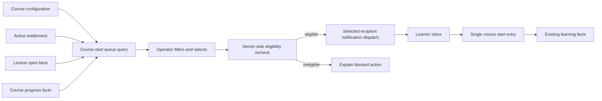

## Goal Capsule

- **Objective:** 让运营能够识别并解释课程访问权已生效但尚未真正开始学习的学员，并在满足边界条件时通过站内消息帮助其进入该课程的开始学习入口。
- **Product authority:** 课程访问权交付只是学习开始的前提；启动队列必须与学习闭环共享事实，尊重触达频率和隐私，不把闲置误读为学员意愿。
- **Open blockers:** 无产品范围阻塞；实现阶段仍需依据现有权限、通知和学习事实能力确定具体复用方式。

## Product Contract

### Summary

新增课程内启动队列，把课程访问权生效后仍未打开课节或仍为零进度的学员整理成可解释、可筛选、可人工触达的运营工作单元。学员接收到的启动提醒只提供一个明确的开始学习入口；队列不改变访问权和签到事实。

### Problem Frame

访问权发放完成并不代表学习价值已经实现。静态的已购或已获得访问权数据无法直接告诉运营哪些学员还没有启动、闲置了多久、通过什么来源取得访问权，也无法保证触达动作不会超出学员可接受的频率。

本工作把“已获得课程资格但尚未启动”转化为有边界的启动动作，同时保持既有学习事实的含义：首次打开课节、有效进度和完成状态仍由学习闭环产生，运营提醒本身不构成学习行为。

### Key Decisions

- **课程内队列优先于全站汇总工作台**（session-settled: user-approved — chosen over 全站待启动工作台: 课程阈值和触达规则按课程配置，课程内处理更容易解释和治理）。
- **站内消息作为首版触达动作**（session-settled: user-directed — chosen over 人工外部触达或只记录动作: 现有通知能力可承载可追踪的启动提醒，并能把学员带回学习端）。
- **阈值和频率均按课程配置**（session-settled: user-directed — chosen over 全局统一规则: 不同课程的学习节奏和运营节奏可能不同）。
- **闲置时长从访问权生效时间起算**（session-settled: user-directed — chosen over 从课程发布或来源事件起算: 规则直接衡量访问权交付后的启动情况）。

### Requirements

**队列资格与事实口径**

- R1. 系统应在课程范围内识别访问权仍有效、访问权已生效并超过该课程闲置阈值，且学员未打开课节或总体进度仍为零的学员。
- R2. 系统应将“从未打开课节”和“打开过课节但仍为零进度”作为可区分的队列状态。
- R3. 队列应沿用学习闭环的访问权来源、访问权生效时间、首次打开课节、有效进度和最近学习时间事实，不因进入队列或发送提醒而改变这些事实。
- R4. 队列应排除访问权已失效、已完成课程或已经产生有效进度的学员；课程没有可学习的有效课节时，不得把学员标记为未学习对象。

**解释与运营处理**

- R5. 运营应能按访问权来源、课程和闲置时长查看、筛选和排序队列对象，并能理解每个对象为何进入队列。
- R6. 运营只有在显式选择对象并发起明确的启动提醒动作后，系统才可发送站内消息；系统不得因对象进入队列而自动发送消息。
- R7. 启动提醒应指向对应课程的单一开始学习入口，不应向学员展示多个并列的课程启动选择。
- R8. 对每门课程，系统应执行该课程配置的触达频率和触达次数上限；未满足触达条件的对象可以留在队列中，但不得被本次动作发送。
- R9. 触达记录应能让运营判断对象是否已经处理以及当前动作是否受频率限制，且不得展示完成触达所不必要的隐私信息。

**权利与学习事实边界**

- R10. 启动队列和启动提醒不得撤回、暂停或修改课程访问权，尤其不得撤回支付成功产生的付费课程访问权。
- R11. 未打开课节、零进度、进入队列或收到提醒均不得被计为签到、完成、缺勤或其他学习结果。
- R12. 队列展示应明确闲置时长是基于访问权生效后的事实窗口，不得将其表述为学员拒绝学习、放弃课程或具有确定意愿。

### Key Flows

- F1. 课程队列识别
  - **Trigger:** 运营查看某门课程的启动队列。
  - **Actors:** 运营、课程访问权学员。
  - **Steps:** 系统读取课程阈值和学习事实；筛出符合 R1 的对象；为对象标记 R2 的启动状态；展示 R5 所需的解释信息。
  - **Outcome:** 运营得到按课程规则生成的待启动对象清单，不改变任何学习事实。
  - **Covered by:** R1, R2, R3, R4, R5, R12

- F2. 人工发起启动提醒
  - **Trigger:** 运营从队列中选择一个或多个符合触达条件的对象并发起提醒。
  - **Actors:** 运营、学员、站内消息能力。
  - **Steps:** 系统再次检查课程触达规则；允许符合规则的对象发送站内消息；消息提供 R7 的单一开始学习入口；记录处理和触达结果。
  - **Outcome:** 学员收到边界明确的启动帮助，运营可以识别发送结果，访问权和学习结果保持不变。
  - **Covered by:** R6, R7, R8, R9, R10, R11

- F3. 学员从提醒开始学习
  - **Trigger:** 学员打开启动提醒并选择开始学习入口。
  - **Actors:** 学员、学习端。
  - **Steps:** 学习端打开对应课程的开始学习入口；学员是否打开课节、产生有效进度或完成课程，继续由既有学习闭环记录。
  - **Outcome:** 学员拥有单一、可理解的启动路径，提醒不会被当作学习行为。
  - **Covered by:** R3, R7, R11, R12

### Acceptance Examples

- AE1. **超过阈值且从未打开**
  - **Given:** 学员有有效课程访问权，访问权生效时间已超过课程阈值，从未打开课节。
  - **When:** 运营查看该课程启动队列。
  - **Then:** 学员出现在队列中，状态为“从未打开”，并显示访问权来源和闲置时长。
  - **Covers:** R1, R2, R5

- AE2. **打开过但零进度**
  - **Given:** 学员已打开过课节但总体有效进度为零，且访问权生效时间已超过课程阈值。
  - **When:** 运营查看队列。
  - **Then:** 学员出现在队列中，并与从未打开的学员使用不同状态说明。
  - **Covers:** R1, R2, R3

- AE3. **未超过阈值不进入触达对象**
  - **Given:** 学员有有效访问权但尚未超过课程闲置阈值。
  - **When:** 运营发起启动提醒。
  - **Then:** 系统不把该学员作为本次提醒对象发送消息，并保留其正常学习资格。
  - **Covers:** R1, R6, R8, R10

- AE4. **频率限制生效**
  - **Given:** 学员符合队列资格，但已达到该课程配置的触达次数或仍在冷却期内。
  - **When:** 运营选择该学员并发起提醒。
  - **Then:** 系统阻止本次发送并向运营说明触达受限，不撤回访问权。
  - **Covers:** R8, R9, R10

- AE5. **提醒不制造学习结果**
  - **Given:** 学员进入队列并收到启动提醒，但尚未打开课程或产生有效进度。
  - **When:** 学习事实被查询。
  - **Then:** 学员仍保持原有的未启动/零进度事实，提醒不被计为签到或完成。
  - **Covers:** R3, R11, R12

- AE6. **付费访问权不受队列影响**
  - **Given:** 学员通过支付成功取得课程访问权，长期未启动。
  - **When:** 运营查看或处理该学员的启动队列项。
  - **Then:** 系统只能提供查看和符合规则的提醒动作，不提供因未学习而撤回访问权的动作。
  - **Covers:** R10

### Scope Boundaries

**In scope**

- 单门课程内的待启动队列。
- 课程级闲置阈值、触达频率和次数上限。
- 按来源、课程和闲置时长解释、筛选和处理对象。
- 运营显式发起的站内启动提醒。
- 学员侧对应课程的单一开始学习入口。
- 与既有学习事实、访问权和通知记录共享事实口径。

**Deferred for later**

- 跨课程汇总的全站待启动工作台。
- 短信、邮件和第三方渠道触达。
- 自动触达、自动培育流程和基于闲置的营销编排。
- 依据队列状态自动调整访问权、签到或学员状态。
- 以触达效果为目标的增量实验和归因分析。

### Success Criteria

- 运营能够仅凭队列信息解释对象为何进入队列，以及闲置时长如何计算。
- 运营能够在课程阈值、频率和次数限制下，显式选择对象并完成站内启动提醒。
- 学员从提醒进入对应课程时只有一个明确的开始学习入口。
- 发送提醒不会改变访问权状态、学习进度、签到或完成事实。
- 队列中的来源、首次打开、有效进度和完成事实与既有学习闭环保持一致。

### Sources / Research

- `CONTEXT.md`：课程访问权、付费访问权不可取消、课节进度、有效课节和学习记录的领域定义。
- `docs/adr/0002-paid-access-is-irrevocable.md`：支付成功产生的课程访问权不可取消。
- `packages/contracts/src/learningFactFunnel.ts`：现有学习事实漏斗已定义访问权生效、首次打开、有效进度和完成阶段，并区分来源和窗口。
- `packages/contracts/src/courseStudent.ts`：现有课程学员事实包含访问权来源、访问权状态、进度、学习状态、最近学习时间和访问权生效时间。
- `packages/contracts/src/notification.ts`、`packages/contracts/src/adminNotification.ts`：现有学习端通知和后台站内消息契约。
- `apps/admin/src/views/catalog/LearningFactFunnelView.vue`、`apps/admin/src/views/students/CourseStudentView.vue`：现有管理端学习事实和课程学员工作流。

### Outstanding Questions

- **Deferred to Planning:** 课程级阈值、频率和次数上限的具体配置入口、默认值及权限边界。
- **Deferred to Planning:** 单一开始学习入口如何复用现有学习端路由和最近课节规则。
- **Deferred to Planning:** 站内消息模板、发送结果状态和队列项处理状态如何复用现有通知能力。

<!-- ce-section: work-relationships -->
### How This Work Fits Together

本次工作聚焦课程内启动队列，依赖既有访问权、学习事实和站内通知能力，并为学员侧提供对应课程的单一开始学习入口。全站跨课程待启动工作台、自动触达编排和触达效果分析与本次队列互补，但不属于当前 Product Contract 的活动范围。

---

## Planning Contract

### Product Contract Preservation

Product Contract unchanged. Planning adds implementation choices without changing the confirmed product behavior, scope, or stable R/A/F/AE IDs.

### Key Technical Decisions

- KTD1. **Extend the course-student query boundary for queue reads.** Keep queue qualification beside the existing course-scoped learner list and reuse its data-scope guard, rather than creating a parallel learner cohort service. This keeps course visibility and entitlement selection consistent with `CourseStudentService` and `LearningFactFunnelService`.
- KTD2. **Use a forward-only course configuration migration with explicit defaults.** Store the course-level idle threshold, reminder frequency, and reminder cap as configuration owned by the course; existing courses receive documented defaults during migration so historical entitlements remain evaluable without backfill. The exact field representation remains an implementation detail for execution.
- KTD3. **Enforce eligibility at send time, server-side.** The queue response is a view that can become stale. The reminder action must re-check active entitlement, course threshold, zero-progress/start state, effective-lesson availability, and the course's frequency/cap policy immediately before dispatch.
- KTD4. **Reuse the selected-recipient notification dispatch path.** Create a course-linked internal-message dispatch using the existing fan-out, learner inbox, idempotency, and audit behavior. The learner-facing resource must resolve to the course start entry, while reminder kind and metadata remain distinguishable from generic internal messages.
- KTD5. **Derive “opened but zero progress” from lesson facts, not only aggregate progress.** The existing aggregate enrollment status collapses no enrollment and zero progress into `not_started`; queue records need an explicit first-open signal from lesson progress so operators can explain the difference without changing progress semantics.

### High-Level Technical Design

The queue is a read-and-validate action layer over existing facts:

Queue qualification uses the active latest entitlement for the course, the access-right effective timestamp, whether any effective lesson exists, lesson-open evidence, aggregate progress/completion, and reminder history. The queue must treat the effective timestamp as the idle-window origin and must not infer learner intent from elapsed time.

Reminder dispatch is a guarded transition rather than a queue mutation: selection requests validation, validation applies the current course policy and learner facts, and only successful validation creates a course-linked dispatch. A failed or stale selection leaves the queue and learning facts unchanged.

### Implementation Constraints

- Preserve the existing department data-scope guard for all course-scoped operator reads and writes.
- Keep paid access rights irrevocable; no queue action may call or expose a revoke path.
- Keep learning facts authoritative: reminder creation cannot insert lesson progress, enrollment completion, or attendance facts.
- Use the project's existing forward migration convention for schema changes; do not rewrite applied migrations.
- Treat learner-facing notification content as privacy-sensitive: include only the course context and start action needed by the learner.
- Keep reminder dispatch idempotent across retries and concurrent operator submissions.

### Research Findings

- `apps/api/app/service/CourseStudentService.php` already joins the latest course entitlement with the course enrollment and applies the course data-scope guard, but currently exposes only aggregate `learning_status`; it is the natural read boundary to extend for queue-specific state.
- `apps/api/app/service/LearningFactFunnelService.php` computes access-right windows from entitlement creation time and distinguishes lesson opens from valid progress; its time-zone and effective-lesson rules should be reused rather than recreated.
- `apps/api/app/service/MessageService.php` owns learner inbox writes, idempotency, unread counts, and optional push notification. `apps/api/app/service/NotificationDispatchService.php` owns selected-recipient internal-message fan-out and dispatch records.
- `apps/api/app/service/LearningReminderService.php` and `apps/api/tests/LearningReminderRuleTest.php` / `LearningReminderThrottleTest.php` provide an adjacent reminder rule and throttle pattern; implementation should reuse their boundary behavior while keeping this feature manually initiated and course-scoped.
- `apps/api/database/migrations/20260823000004_create_learning.php` establishes the entitlement, enrollment, and lesson-progress lifecycle. `apps/api/database/migrations/20260829000001_notification_dispatches.php` and `20260904000002_learning_action_loop.php` establish notification dispatch and learning-action integration patterns.
- The project requires backend validation through Docker Compose and rebuilding the affected API/admin/web images after source changes; these are execution constraints for `ce-work`, not steps to run during planning.

### Dependencies and Sequencing

1. Define the course configuration contract and forward migration, including defaults and validation boundaries.
2. Extend shared contracts and backend queue read logic with explicit queue state and explainable fields.
3. Add the guarded course reminder action and connect it to the existing notification dispatch and learner resource-link behavior.
4. Add management UI controls for course policy, queue filters, selection, blocked-send explanations, and dispatch result visibility.
5. Add or update learner notification handling so the course-linked message exposes one start entry, then complete cross-layer verification.

### Risks and Mitigations

- **Stale queue selections:** Revalidate every selected learner at send time and report per-object ineligibility without sending to that object (KTD3).
- **Source-of-truth drift:** Derive queue state from entitlement, lesson progress, and enrollment facts; avoid a denormalized “未学习” flag that can diverge (KTD5).
- **Over-contacting learners:** Apply course frequency and cap rules atomically with dispatch eligibility, use existing idempotency behavior, and make blocked reasons visible to operators.
- **Data-scope leakage:** Reuse course access checks for both queue reads and reminder actions, and verify a staff member cannot select learners outside the accessible course scope.
- **Empty or invalid courses:** Exclude courses without effective lessons and preserve the existing funnel disclaimer semantics; do not create a start action that cannot lead to learnable content.
- **Historical configuration ambiguity:** Give existing courses explicit defaults in the forward migration and surface the effective policy to operators before they send reminders.

### Assumptions

- Course policy values are configured by staff who already have the relevant course-management permission; final permission-code mapping follows the repository's authorization conventions during implementation.
- A single course start entry can reuse the existing learner course-entry/recent-learning resolution; if that resolver cannot guarantee one entry, implementation must expose the smallest existing course-level start route without changing product scope.
- The initial queue is synchronous on read and manually initiated on send; no scheduled evaluator or automatic reminder worker is required for this scope.

---

## Implementation Units

### U1. Add course startup policy configuration

- **Goal:** Give each course an explicit idle threshold, reminder frequency, and reminder cap with safe defaults for existing courses.
- **Requirements:** R8; R12; Success Criteria 1 and 2.
- **Dependencies:** None.
- **Files:** `apps/api/database/migrations/`; course model/service/controller files discovered from existing course edit APIs; `packages/contracts/src/catalog.ts`; relevant course-edit API and tests.
- **Approach:** Add a forward migration and validation path following existing course configuration conventions. Keep defaults explicit and ensure invalid, negative, or contradictory policy values cannot be saved. Return the effective policy to authorized management surfaces so queue behavior is explainable.
- **Patterns to follow:** Course editing and catalog contracts; forward-only migrations; existing authorization and validation error mapping.
- **Test scenarios:**
  - Save valid threshold, frequency, and cap values and read back the same effective policy.
  - Reject zero/negative values and a cap or frequency that violates the policy contract.
  - Existing course without policy uses the documented default without modifying entitlement or learning records.
  - Staff outside the course data scope cannot read or update its policy.
- **Verification:** Policy is persisted, validated, returned consistently to admin clients, and existing course fixtures remain readable.

### U2. Build the explainable course start queue

- **Goal:** Return a paginated course-scoped queue with distinct startup states and sortable/filterable explanation fields.
- **Requirements:** R1-R5, R12; F1; AE1, AE2, AE3, AE6.
- **Dependencies:** U1.
- **Files:** `apps/api/app/service/CourseStudentService.php`; `apps/api/app/controller/admin/CourseStudentController.php`; `packages/contracts/src/courseStudent.ts`; `apps/admin/src/api/courseStudents.ts`; `apps/api/tests/CourseStudentTest.php`; new or expanded queue contract/admin API tests.
- **Approach:** Extend the existing course learner read boundary or a directly adjacent service method. Select active latest entitlements, join enrollment facts, derive first lesson-open evidence, exclude completed/positive-progress/ineligible cases, calculate idle duration from entitlement creation time, and return the applied policy plus an explicit reason/state. Preserve pagination and data-scope behavior.
- **Patterns to follow:** Existing latest-entitlement query and `CourseStudentService::shapeItem`; funnel window/time-zone logic; `CourseStudentView` filter conventions.
- **Test scenarios:**
  - Covers AE1. Active entitlement past threshold with no lesson progress appears as `never_opened` with source and idle duration.
  - Covers AE2. A lesson-open record with zero aggregate progress appears as `opened_zero_progress`, distinct from `never_opened`.
  - Covers AE3. Entitlement inside the course threshold is excluded from the eligible queue.
  - Completed, positive-progress, revoked, and no-effective-lesson cases are excluded.
  - Source and idle-duration filters/sorts preserve pagination totals and do not leak out-of-scope courses.
  - A reactivated learner uses the current active entitlement's effective time and source, while historical revoked rows do not qualify.
- **Verification:** API output has stable contract validation, explainable state for every returned row, correct boundary behavior, and no mutations to learning facts.

### U3. Add guarded course reminder dispatch

- **Goal:** Let an operator explicitly send a course-linked startup reminder only to currently eligible, non-throttled queue objects.
- **Requirements:** R6-R11; F2; AE4, AE5, AE6.
- **Dependencies:** U1, U2.
- **Files:** `apps/api/app/service/NotificationDispatchService.php`; `apps/api/app/service/MessageService.php`; `apps/api/app/controller/admin/NotificationController.php` or a course-scoped controller; `packages/contracts/src/adminNotification.ts`; `packages/contracts/src/notification.ts`; notification migrations if needed; `apps/api/tests/NotificationDispatchTest.php`; new queue reminder integration tests.
- **Approach:** Add a course-scoped command that accepts selected learner IDs and revalidates each against the current queue policy. Reuse selected-recipient dispatch, attach the course resource, use a dedicated learning-reminder kind, and make the body/template contain one course start action. Apply frequency/cap checks before creating dispatch records; return eligible, blocked, and already-throttled outcomes without partial unauthorized sends.
- **Patterns to follow:** `NotificationDispatchService::sendInternalMessage`, `MessageService::KIND_LEARNING_REMINDER`, `NotificationFanOutExecutor` idempotency, and existing notification authorization tests.
- **Execution note:** Implement the eligibility and throttle tests before wiring the admin action, because a client-only guard would leave a direct API path unprotected.
- **Test scenarios:**
  - Covers AE4. Eligible selected learner receives one course-linked reminder and a dispatch record is created.
  - A stale selection is rejected when the learner starts learning, completes the course, loses active entitlement, or crosses into an invalid course state before send.
  - Frequency cooldown and count cap block sends with an explainable result and create no new learner notification.
  - Paid entitlement remains active and no revoke operation is reachable through the reminder command.
  - Duplicate/concurrent submissions do not create duplicate learner inbox rows or exceed the configured cap.
  - Staff lacking course visibility or notification permission cannot send reminders.
  - Covers AE5. Sending a reminder leaves lesson progress, enrollment progress, completion, and attendance-related facts unchanged.
- **Verification:** Direct API calls enforce the same rules as the UI, dispatches are course-linked and idempotent, and all blocked paths are auditable without exposing unnecessary learner data.

### U4. Add management policy and queue workflow

- **Goal:** Give operators a course-local workflow to configure policy, inspect explanations, select eligible learners, and see send results.
- **Requirements:** R5-R9; F1-F2; Success Criteria 1 and 2.
- **Dependencies:** U1, U2, U3.
- **Files:** `apps/admin/src/views/students/CourseStudentView.vue`; `apps/admin/src/views/catalog/LearningFactFunnelView.vue` if the queue is surfaced there; `apps/admin/src/api/courseStudents.ts`; new admin components only where existing patterns do not fit; `apps/admin/tests/CourseStudentView.test.ts`; new queue workflow tests.
- **Approach:** Add a course-local queue view or tab using existing admin list/filter/pager patterns. Show source, effective time, idle duration, startup reason, current progress, and policy context. Allow explicit selection and reminder submission, disable or explain ineligible/throttled rows, and refresh after dispatch. Do not expose revoke controls as a side effect of this workflow.
- **Patterns to follow:** `CourseStudentView.vue`, `LearningFactFunnelView.vue`, `NotificationComposeDialog.vue`, Element Plus form/table/pager conventions, and existing permission helpers.
- **Test scenarios:**
  - Queue loads with policy, source filter, startup-state filter, idle-duration display, pagination, and empty state.
  - Selecting eligible rows enables the reminder action; selecting blocked rows shows the reason and does not silently send.
  - Successful send refreshes queue/dispatch state and preserves the single course context.
  - API validation or permission failure is rendered without losing current filters or accidentally retrying.
  - Paid rows never show a revoke action in the startup workflow.
- **Verification:** An operator can complete the course-local identify, explain, select, and send workflow without navigating to a global workbench or relying on client-side-only policy enforcement.

### U5. Provide the learner single-start entry

- **Goal:** Make a course startup reminder resolve to one learner-facing entry that leads into the existing learning flow.
- **Requirements:** R7, R11, R12; F3; AE5.
- **Dependencies:** U3.
- **Files:** `packages/contracts/src/notification.ts`; `apps/web/src/api/notifications.ts`; `apps/web/src/stores/notifications.ts`; learner message/inbox view files; existing course-entry and lesson-start route/service files; `apps/web/tests/StudentCenterView.test.ts`; new learner reminder tests.
- **Approach:** Extend the existing notification resource/link handling for a course-linked learning reminder. Resolve exactly one start destination using the existing course entry behavior; do not add alternate lesson choices to the reminder. Keep opening the message distinct from opening a lesson and preserve existing progress recording semantics.
- **Patterns to follow:** Existing learner notification DTO, notification controller resource authorization, `StudentCenterView`, course detail/entry routing, and `MessageService` resource metadata.
- **Test scenarios:**
  - Course-linked reminder renders one start-learning action and routes to the authorized course entry.
  - A learner without active course access cannot use the resource link to bypass access checks.
  - Opening or reading the reminder alone does not create lesson progress, completion, or attendance.
  - Missing/archived effective lessons produces the existing unavailable-course behavior rather than a misleading start action.
  - Existing notification kinds and generic internal messages retain their current rendering and routing.
- **Verification:** The reminder is private to its recipient, has one actionable entry, and the learner's existing learning facts change only after actual learning interactions.

---

## Verification Contract

| Gate | Evidence | Applies to |
|---|---|---|
| Contract and unit coverage | Shared Zod contracts accept valid queue/policy/reminder payloads and reject invalid states; PHP service tests cover qualification and throttle boundaries. | U1-U3, U5 |
| Authorization and scope | Course data-scope and notification permission tests cover reads, policy writes, and sends for allowed and disallowed staff. | U1-U4 |
| Cross-layer reminder flow | API integration coverage proves selected eligible learners receive course-linked notifications through the existing dispatch/fan-out path, while stale or throttled selections do not. | U3-U5 |
| Learner behavior | Frontend tests prove one start entry, authorized resource resolution, and no progress mutation from notification interaction. | U5 |
| Regression | Existing course-student, learning-funnel, notification, reminder-throttle, and student-center tests remain green. | U2-U5 |
| Runtime verification | After implementation, rebuild affected API/admin/web images per repository instructions and run the project Docker-based backend, frontend, formatting, and relevant browser gates. | All units |

## Definition of Done

- Course-level policy is persisted with explicit defaults, validated, permission-protected, and visible to the operator.
- The course-local queue identifies only currently eligible learners and explains source, startup state, effective time, and idle duration.
- Server-side send-time validation enforces current eligibility, frequency, cap, access, and data-scope rules.
- Startup reminders use the existing selected-recipient notification lifecycle, are course-linked and idempotent, and expose one learner start entry.
- No implementation path revokes paid access rights or changes progress, completion, attendance, or other learning facts merely because of queue membership or reminder delivery.
- Required backend, contract, frontend, integration, and browser verification evidence is present according to the Verification Contract.
- No abandoned experimental queue, notification, or policy code remains in the final change.

## Deferred to Follow-Up Work

- Cross-course aggregation into a global startup workbench.
- Automatic scheduled reminders, multi-channel delivery, campaign orchestration, and experimental attribution.
- New attendance, withdrawal, or entitlement-revocation semantics.
